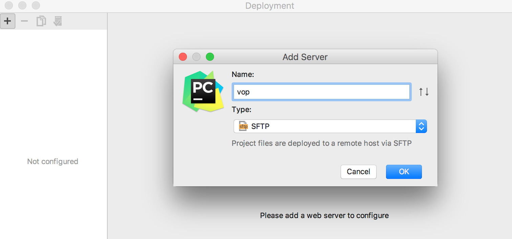
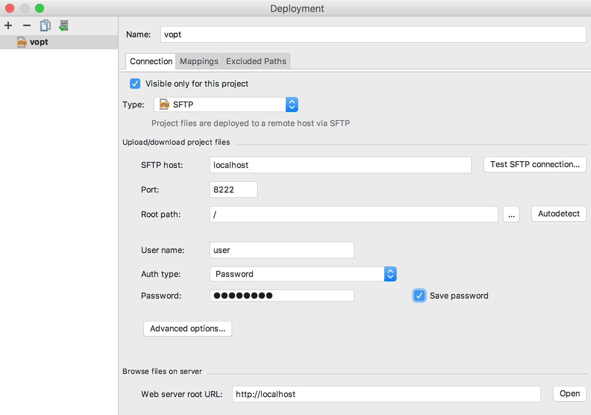
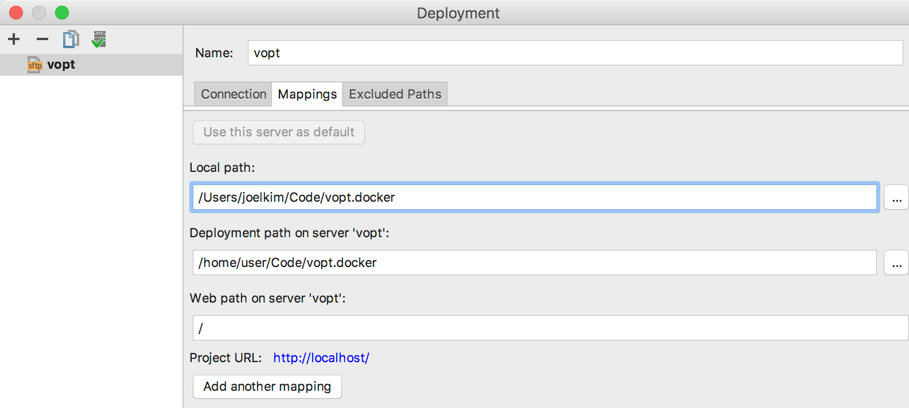
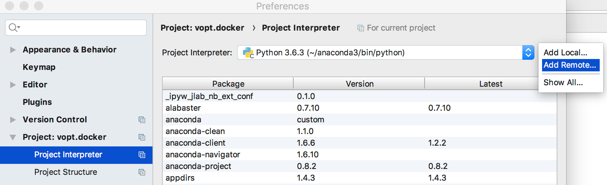
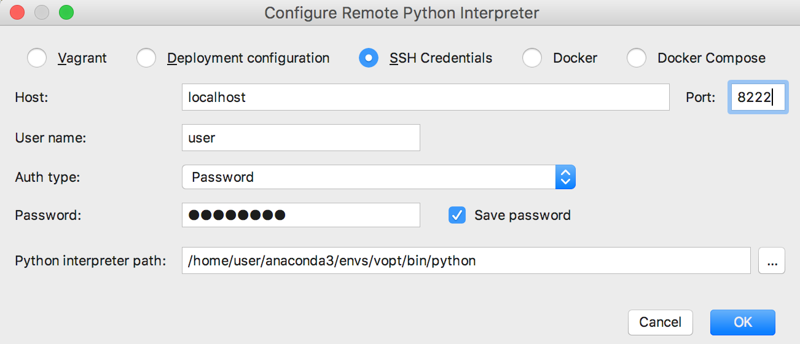

PyCharm Remote Environment for `vopt` Docker
============================================

To use vopt docker container in PyCharm, 
you need to complete the following settings and configurations.

1. run the docker container with ssh service.
1. set up PyCharm "Deployment" setting.
1. upload the source code
1. set up PyCharm "remote python interpreter" setting.
1. install the source code in the container


(1) Run Docker Container with ssh Service
----------------------------------------

1. Run docker container.
   The `vopt` docker container starts with ssh service in port 22 automatically.
   Since port 22 is often used by other services,
   forward the port 22 to other port to avoid a confliction, 
   for example 8222.

    ```
    $ docker run --name vopt --rm -Pit -p 8222:22 veranostech/vopt
    ```

2. You can return to your console without quit the docker container 
   by pressing `Ctrl-p` + `Ctrl-q`.
   
   **DO NOT EXIT** from the container using an `exit` command or the equivalents. 
   Then the container quits forever.
 

(2) Set Up PyCharm "Deployment" Setting
---------------------------------------

1. Select Tools > Deployment > Configuration in PyCharm menu.
2. Press [+] button.
3. In "Add Server" dialog, complete the inputs and press OK.

   * Name: `vopt`
   * Type: `SFTP`
   
   
   
4. In "connection" tab of "Deployment" dialog, complete the inputs:

   * SFTP host: `localhost` (or `192.168.99.100` if docker toolbox is used)
   * Port: `8222`
   * Root path: \\
   * User name: `user`
   * Auth type: `Password`
   * Password: `userpass`
   * Save password: checked
   
    

   and then select "Mappings" tab and complete the inputs:
   
   * Local path: path to your notebook's code directory. 
                 for example `/Users/joelkim/Code/vopt.factor`
   * Deployment path on server "vopt": path to docker's code directory.
                                       for example `/home/user/Code/vopt.factor`

    


(3) Upload the Source Code
--------------------------

1. Select the project root director in PyCharm Project Window.
1. Select Tools > Deployment > Upload to vopt
1. Check the docker's container to confirm the code sync.
   You can re-enter the docker container using the following command:

   ```
   $ docker attach vopt
   ```

   Also you can return to your console by pressing `Ctrl-p` + `Ctrl-q`.


(4) Set Up PyCharm "Remote Python Interpreter" Setting
------------------------------------------------------

1. Select "Preference" (on Mac) or "Project Setting" (on Windows) in PyCharm menu.
2. In the dialog, select "Project Interpreter"
3. Pressing a setting button on the right of "Project Interpreter" input.
   Select "Add Remote".
   
   

4. In "connection" tab of "Deployment" dialog, complete the inputs:

   * Host: `localhost` (or `192.168.99.100` if docker toolbox is used)
   * Port: `8222`
   * Root path: \\
   * User name: `user`
   * Auth type: `Password`
   * Password: `userpass`
   * Save password: checked
   * Python interpreter path: `/home/user/anaconda3/envs/vopt/bin/python`
   
    
   
   Press OK and wait until PyCharm apply the package indexing.


(5) (Optional) Install the package
----------------------------------

If you need to install the source code in docker container, 
attach the docker and install it.
